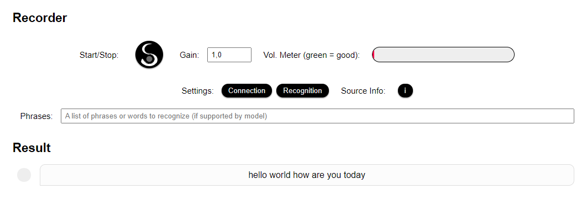

# SEPIA Speech-To-Text Server

SEPIA Speech-To-Text (STT) Server is a WebSocket based, full-duplex Python server for realtime automatic speech recognition (ASR) supporting multiple open-source ASR engines.
It can receive a stream of audio chunks via the secure WebSocket connection and return transcribed text almost immediately as partial and final results.  
  
One goal of this project is to offer a **standardized, secure, realtime interface** for all the great open-source ASR tools out there.
The server works on all major platforms including single-board devices like Raspberry Pi (4).  
  
NOTE: This is a complete **rewrite** (2021) of the original STT Server (2018). Code of the old version has been moved to the [LEGACY SERVER](legacy-server) folder.  
If you are using custom models built for the 2018 version you can easily [convert them to new models](https://github.com/fquirin/kaldi-adapt-lm/blob/master/4a-build-vosk-model.sh) (please ask for details via the issues section).

<p align="center">
  
</p>

## Features

* WebSocket server (Python Fast-API) that can **receive audio streams and send transcribed text at the same time**
* Modular architecture to **support multiple ASR engines** like Vosk (reference implementation), Coqui, Deepspeech, Scribosermo, ...
* Optional **post processing** of result (e.g. via [text2num](https://github.com/allo-media/text2num) and custom modules)
* **Standardized API for all engines** and support for individual engine features (speaker identification, grammar, confidence score, word timestamps, alternative results, etc.)
* **On-the-fly server and engine configuration** via HTTP REST API and WebSocket 'welcome' event (including custom grammar, if supported by engine and model)
* **User authentication** via simple common token or individual tokens for multiple users
* Docker containers with **support for all major platform architectures**: x86 64Bit (amd64), ARM 32Bit (armv7l) and ARM 64Bit (aarch64)
* Fast enough to **run even on Raspberry Pi 4 (2GB) in realtime** (depending on engine and model configuration)
* Compatible to [SEPIA Framework client](https://github.com/SEPIA-Framework/sepia-html-client-app) (v0.24+)

## Integrated ASR Engines

- [Vosk](https://github.com/alphacep/vosk-api) - Status: Ready. Includes tiny EN and DE models.
- [Coqui](https://github.com/coqui-ai/STT) - Status: Planned.
- [Scribosermo](https://gitlab.com/Jaco-Assistant/Scribosermo) - Status: Help wanted.
- [TensorFlowASR](https://github.com/TensorSpeech/TensorFlowASR) - Status: Help wanted.
- If you want to see additional engines please create a new [issue](https://github.com/SEPIA-Framework/sepia-stt-server/issues). Pull requests are welcome ;-)

## Quick-Start

The easiest way to get started is to use a Docker container for your platform:
- ARM 32Bit (Raspberry Pi 4 32Bit OS): `docker pull sepia/stt-server:vosk_armv7l`
- ARM 64Bit (RPi 4 64Bit, Jetson Nano(?)): `docker pull sepia/stt-server:vosk_aarch64`
- x86 64Bit Systeme (Desktop PCs, Linux server etc.): `docker pull sepia/stt-server:v2_amd64_beta`

After the download is complete simply start the container, for example via:  
```
sudo docker run --rm --name=sepia-stt -p 20741:20741 -it sepia/stt-server:[image-tag]
```

To test the server visit: `http://localhost:20741` if you are on the same machine or `http://[server-IP]:20741` if you are in the same network (NOTE: custom recordings via microphone will only work using localhost or a HTTPS URL!).

## Server Settings

Most of the settings can be handled easily via the [server.conf settings file](src/server.conf). Please check out the file to see whats possible.

ENV variables:
- `SEPIA_STT_SETTINGS`: Overwrites default path to settings file

Commandline options:
- Use `python -m launch -h` to see all commandline options
- Use `python -m launch -s [path-to-file]` to use custom settings

NOTE: Commandline options always overrule the settings file but in most scenarios it makes sense to simply create a new settings file and use the `-s` flag.

## ASR Engine Settings

As soon as the server is running you can check the current setup via the HTTP REST interface: `http://localhost:20741//settings` or the test page (see quick-start above).  
  
Individual settings for the active engine can be changed on-the-fly during the WebSocket 'welcome' event. See the [API docs](API.md) file for more info or check out the 'Engine Settings' section of the test page.

## How to use with SEPIA Client

The [SEPIA Client](https://github.com/SEPIA-Framework/sepia-html-client-app) will support the new STT server out-of-the-box from **version 0.24.0** on. 
Simply open the client's settings, look for 'ASR engine (STT)' and select `SEPIA`. The server address will be set automatically relative to your SEPIA Server host. 
If your SEPIA server proxy has not been updated yet to forward requests to the SEPIA STT-Server you can enter the direct URL via the STT settings page, e.g.: `http://localhost:20741` or `http://localhost:20726/sepia/stt`.
The settings will allow you to select a specific ASR model for each client language as well (if you don't want to use the language defaults set by your STT server config).  
  
NOTE: Keep in mind that the client's microphone will [only work in a secure environment](https://github.com/SEPIA-Framework/sepia-docs/wiki/SSL-for-your-Server) (that is localhost or HTTPS) 
and thus the link to your server must be secure as well (e.g. use a real domain and SSL certificate, self-signed SSL or a proxy running on localhost).

## Develop your own Client

See the separate [API docs](API.md) file or check out the [Javascript client class](src/www/audio-modules/shared/sepia-stt-socket-client.js) and the [test page](src/www/test-page.html) source-code.  
  
Demo clients:
- Server test page(s): `http://localhost:20741` (with microphone) or `http://[server-IP]:20741` (no microphone due to "insecure" origin)
- [SEPIA Client app](https://sepia-framework.github.io/app/) (v0.24+, simply skip the login, go to settings and enter your server URL)

## Using Customized ASR Models

Open-source ASR has improved a lot in the last years but sometimes it makes sense to adapt the models to your own, specific use-case/domain and vocabulary to improve accuracy.
Language model adaptation via web GUI is planned for the near future. Until then please check out the following link:

- Language model adaptation made easy with [kaldi-adapt-lm](https://github.com/fquirin/kaldi-adapt-lm)

### Adapt a model using the Docker image

Before you continue please read the basics about custom model creation on [kaldi-adapt-lm](https://github.com/fquirin/kaldi-adapt-lm) if you haven't already.
You should at least understand what the 'lm_corpus' folder does and have a 'sentences_xy.txt' (xy: your code, e.g. 'en') ready in your language ;-).  
  
If you use one of the newer Docker images (August 2021) 'kaldi-adapt-lm' is already integrated and ready for action. You just need to adjust your Docker start command a bit:
- Add a shared volume (example: '/home/pi/share') for new models, custom settings and to exchange corpus files: `-v /home/pi/share:/home/admin/sepia-stt/share`
- Add ENV variable to use custom settings: `--env SEPIA_STT_SETTINGS=/home/admin/sepia-stt/share/my.conf`
- Add `/bin/bash` at the end to enter the terminal and access 'kaldi-adapt-lm' instead of starting the STT server right away

The result should look similar to this (depending on **your folders and image tag**):
```
sudo docker run --rm --name=sepia-stt -p 20741:20741 -it \
	-v /home/pi/share:/home/admin/sepia-stt/share \
	--env SEPIA_STT_SETTINGS=/home/admin/sepia-stt/share/my.conf \
	sepia/stt-server:vosk_aarch64 \
	/bin/bash
```

Don't start the container yet! First copy your own LM corpus aka 'sentences_xy.txt' to your shared folder on the host machine. In the example we use: '/home/pi/share/sentences_en.txt'. Do the same for 'my_dict_en.txt' if you need to add new words to the dictionary.  
  
When you are ready do the following:
- Start your container with the updated command above. You should see the terminal of your container after a few seconds.
- Copy your own sentences and optionally dictionary from the shared folder to 'kaldi-adapt-lm', e.g.: `cp /home/admin/sepia-stt/share/sentences_*.txt /home/admin/kaldi-adapt-lm/lm_corpus/` and `cp /home/admin/sepia-stt/share/my_dict_*.txt /home/admin/kaldi-adapt-lm/lm_dictionary/`.
- Enter the model adapt folder via `cd /home/kaldi-adapt-lm` and run the adaptation process (more info: [kaldi-adapt-lm](https://github.com/fquirin/kaldi-adapt-lm)):
	- The container has all requirements installed so we can directly download the base model, e.g.: `bash 2-download-model.sh en`.
	- Next step is the actual adaptation process. We use the "safe" mode: `bash 3-adapt.sh en checkVocab optimizeLm`. If you don't get a note about missing vocabulary right away prepare to wait for a while ^^.
	- After a few minutes (~15min for small LMs) you should see the success message. Continue with `bash 4a-build-vosk-model.sh` and finally `bash 5-clean-up.sh`.
	- If you survived all the steps (:-p) you should have a new `adapted_model.zip` available containing your customized model.
- Unzip the content to the shared folder and choose a proper name, e.g.: `unzip -d /home/admin/sepia-stt/share/my-model-v1-en/ adapted_model.zip`

Finally we need to tell the server where to find the new model:
- Copy the original server settings file to the shared folder using the same name defined via 'SEPIA_STT_SETTINGS': `cp /home/admin/sepia-stt/server/server.conf /home/admin/sepia-stt/share/my.conf`.
- Open the new settings in an editor, e.g.: `nano /home/admin/sepia-stt/share/my.conf` and add the fields `path3=../share/my-model-v1-en` and `lang3=en-US` in the `[app]` section (adjust path and language as required).
- Save the changes and leave the editor (for nano: CTRL+X) then return to the home folder and take the server for a test drive: `cd /home/admin` and `bash on-docker.sh`.
- Open the server test page in your browser (see quick-start) and check if your new model appears in log section.
- If you're done testing close the server (CTRL+C) and leave the container terminal via `exit`.
- Congratulations, you have created your own speech recognition model :-).

To keep all your changes don't forget to start your Docker container with the `-v` and `--env` modifications from now on.
